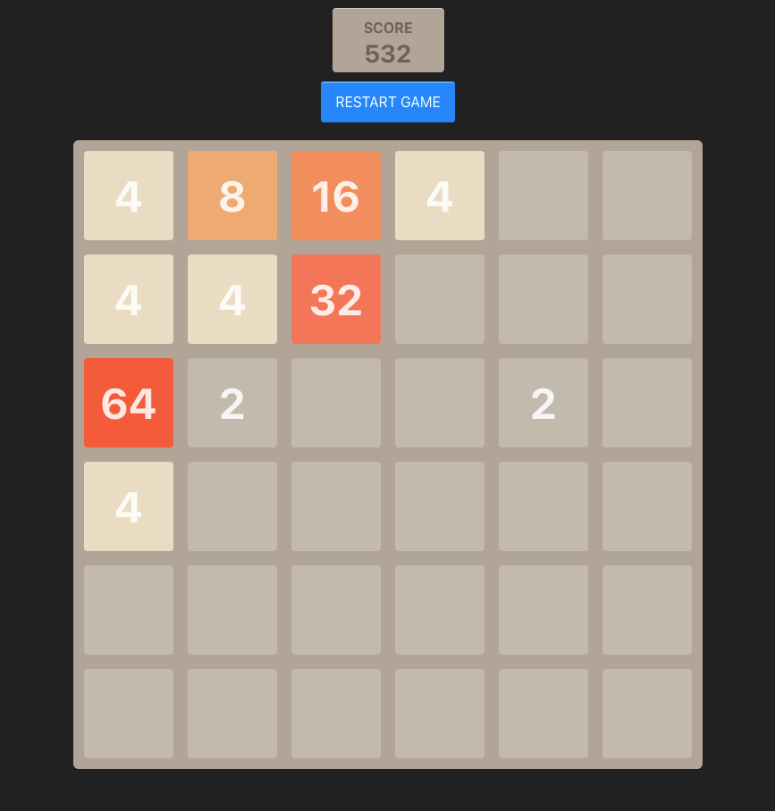

# 2048 Game

A simple game written in React.




## Tech Stack

- Vite
- React
- Typescript
- Styled-components
- Vitest
- React-Testing-Library
- ESLint
- Prettier

> [!NOTE]
> I checked various versions of the 2048 game and they usually add 2 tiles with the value 2 at the start. After the first move, the system adds 1 tile with the value 2. I tried starting with only 1 tile, but it wasn't as fun because it wasn't clear where to move it. Starting with 2 tiles makes the first move more strategic, as the user can already try to merge them together.

## Usage

```bash
  pnpm install
  pnpm dev
```

## Todo

- [ ] Add win status and its animation
- [ ] Add animations
- [ ] Add sound effects
- [ ] Add more tests
- [ ] Add high score (save to localStorage)
- [ ] Nice-to-have: Share replay: show history of all the moves (similar to chess)


## License

MIT
